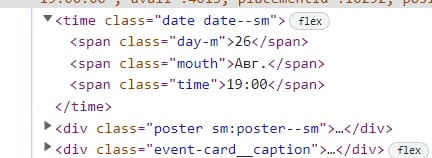
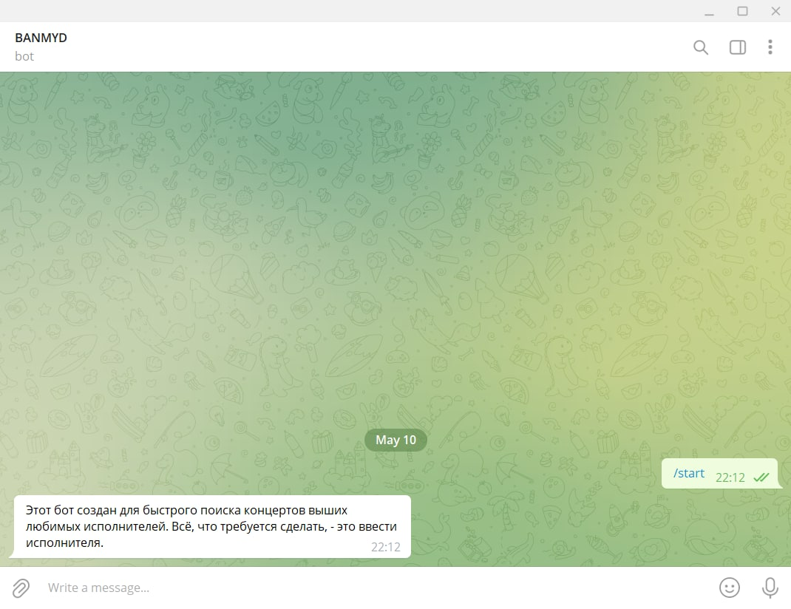
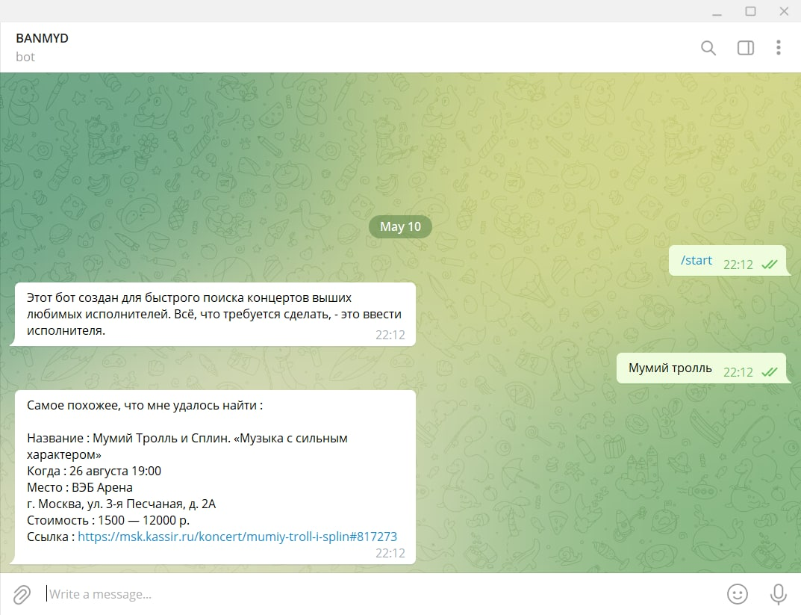
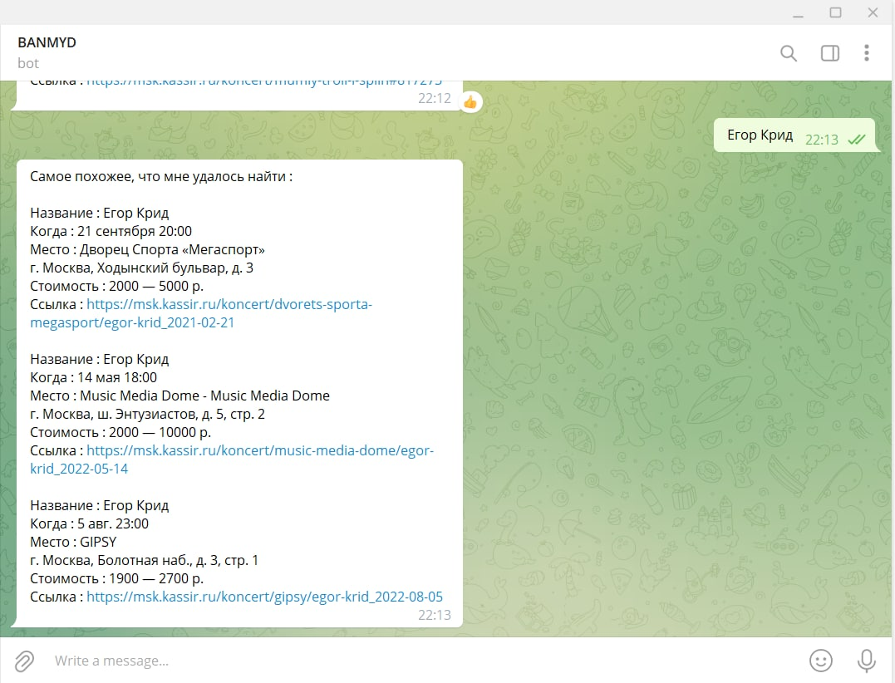
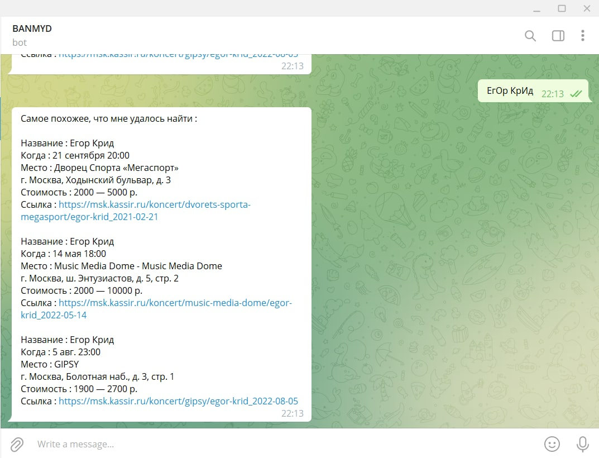
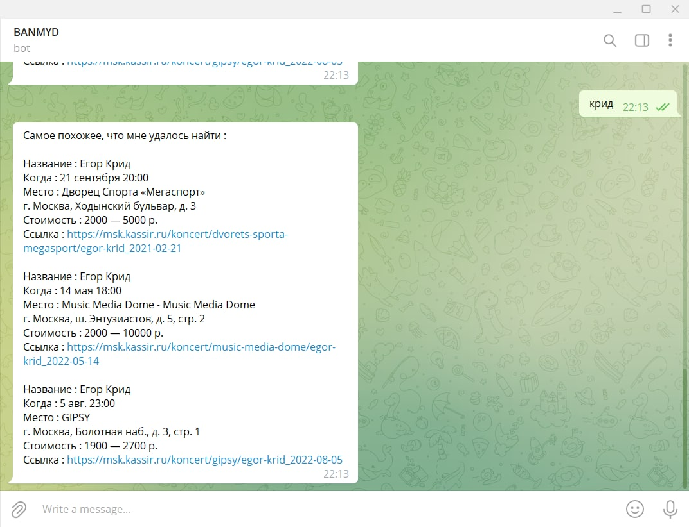
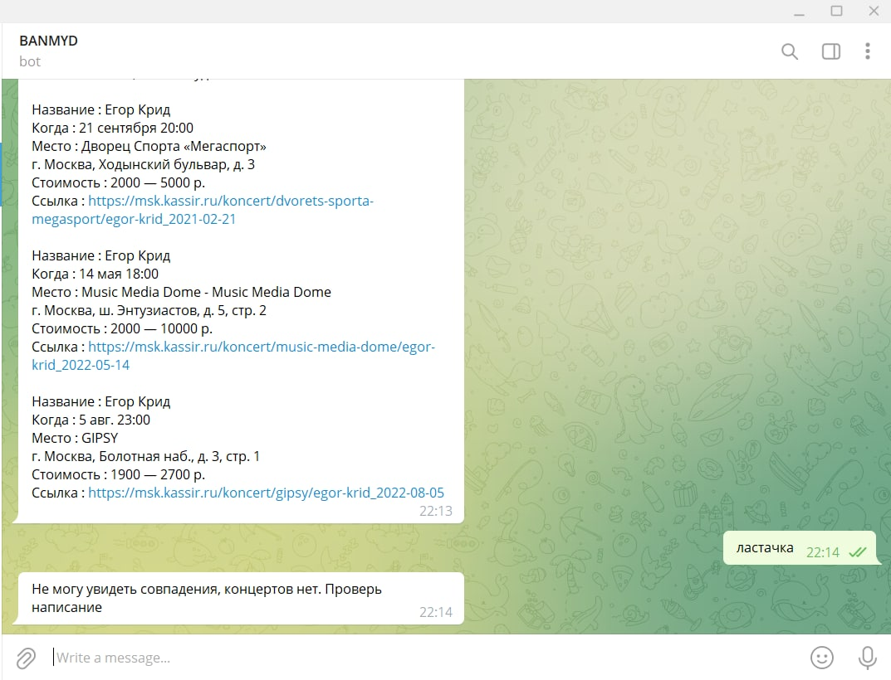

# pythonproject2

INTRODUCTION
------------

 
REQUIREMENTS
------------

**This bot requires the following modules:**

python3 (https://www.python.org/downloads/)

pyTelegramBotAPI (https://pypi.org/project/pyTelegramBotAPI/)

bs4 (https://pypi.org/project/beautifulsoup4/)

requests (https://pypi.org/project/requests/)

lxml (https://pypi.org/project/lxml/)

RECOMMENDED MODULES
-------------------
 
None
 
INSTALLATION
-------------
 
Enter a directory in wich to download the bot script (`cd ./mydir`), install as you would normally install git (`sudo apt-get update && install git`), python3 (`sudo apt-get update && install python3`), clone the github repository (`git clone https://github.com/JanMird/pythonreview2.git`). If there nothing appeared but README.me, try to switch your branch to dev (`git checkout dev`).
 
 **'you are in desired directory'**
   
     sudo apt-get install git
   
     sudo apt-get install python3
   
     git clone https://github.com/JanMird/pythonreview1.git
   
     >git checkout dev (optional)
 
LAUNCH
------
 
 Enter directory with README. Now you are ready to <s>work as frontend</s> start bot. Use following command : `sh script.sh` ...
 
 
 
 **'you are in the same directory as README.md'**
   
     sh script.sh <your token>
 
TROUBLESHOOTING
---------------
 
 If you cloned repository, but script doesnt work:
 
 	- please, check, if there any grammar mistakes or misses in copypaste
 	
 	-try to update bash using following code:
 	
 	    sudo apt-get update && install bash
 
FAQ
---

    Q: I started bash script, and now console freezed with no response after installing requirements.txt. Is that normal?
    
    A: Yes, bot is already working. To stop it you can close console.

EXAMPLES
--------

